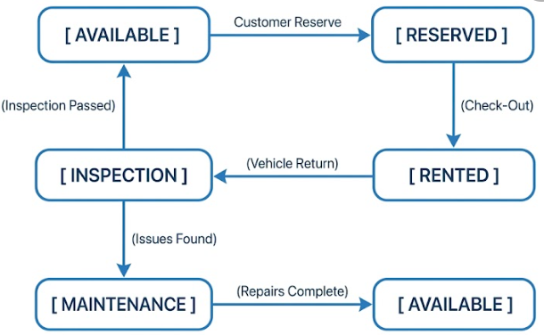

# 🚗 Vehicle Rental & Fleet Management System

A comprehensive, full-stack enterprise application for vehicle rentals, customer bookings, and fleet administration. Built with modern React, Express.js, and MongoDB Atlas.

---

## 📋 Table of Contents

1. [Project Overview](#-project-overview)
2. [Problem Statement](#-problem-statement)
3. [Main Features](#-main-features)
4. [Role-Based Features](#-role-based-features)
5. [Vehicle Types](#-vehicle-types)
6. [Vehicle Lifecycle State Machine](#-vehicle-lifecycle-state-machine)
7. [Core Technical Modules](#-core-technical-modules)
8. [Technology Stack](#-technology-stack)
9. [System Architecture](#-system-architecture)
10. [Project Folder Structure](#-project-folder-structure)
11. [Database — MongoDB Atlas](#-database--mongodb-atlas)
12. [Authentication and Authorization](#-authentication-and-authorization)
13. [API Overview](#-api-overview)
14. [Testing Suite](#-testing-suite)
15. [Team Division & Responsibilities](#-team-division--responsibilities)
16. [Local Setup & Environment Configuration](#-local-setup--environment-configuration)
17. [Development Stages](#-development-stages)

---

## 🌐 Project Overview

The **Vehicle Rental & Fleet Management System** is a unified dual-module enterprise platform designed to manage both ends of the vehicle rental ecosystem:
1. **Customer & Rental Management Module (Member 1)**: Covers customer authentication, vehicle browsing, reservation creation, rental agreement management, recommendation matching, and billing.
2. **Fleet & Administration Module (Member 2)**: Covers fleet inventory CRUD, vehicle lifecycle status controls, automated maintenance locks, repair cost tracking, location tracking, and administrative analytics.

---

## 🚗 Vehicle Lifecycle State Machine



---

## ⚙️ Local Setup & Environment Configuration

### 1. Backend Setup
```bash
cd backend
npm install
npm run dev
```
Backend API will run on `http://localhost:5000`.

### 2. Frontend Setup
```bash
cd frontend
npm install
npm run dev
```
Frontend UI will run on `http://localhost:3000`.
